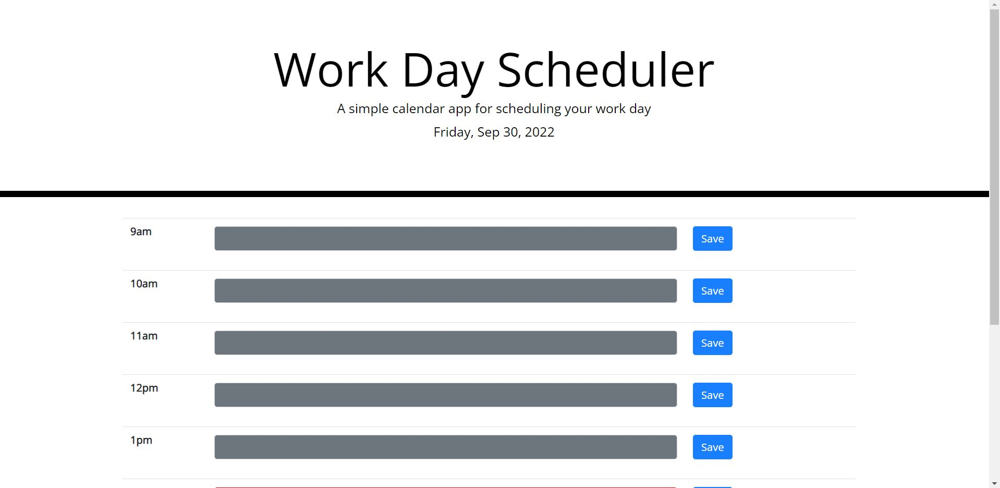

# work-day-scheduler

## Description

The motivation of this project is to build a simple calendar web application that allows a user to save events for each hour of the day. It features dynamically updated HTML and CSS powered by jQuery. This exercise is good practice for utilizing thirdy party APIs such as Bootstrap and Moment.js libraries. This activty uses local storage to store user values for later retrieval. An important concept covered in this activity is using the documentation from third party APIs to understand its implementation to our code. 

Link to Website: https://seangshin.github.io/work-day-scheduler/

## Installation

The following tools were used for the development and testing of this project. Web Browser (Google Chrome preferred) Code development IDE (Microsoft VS Code)

## Usage

Open HTML and CSS code using Code development IDE. Open HTML using Web Browser.

## Credits

Georgia Tech Coding Bootcamp instructors, TA's, and other faculty. Third party APIs Bootstrap, jQuery, Moment.js, Google Fonts, Font Awesome.

## License

Not applicable